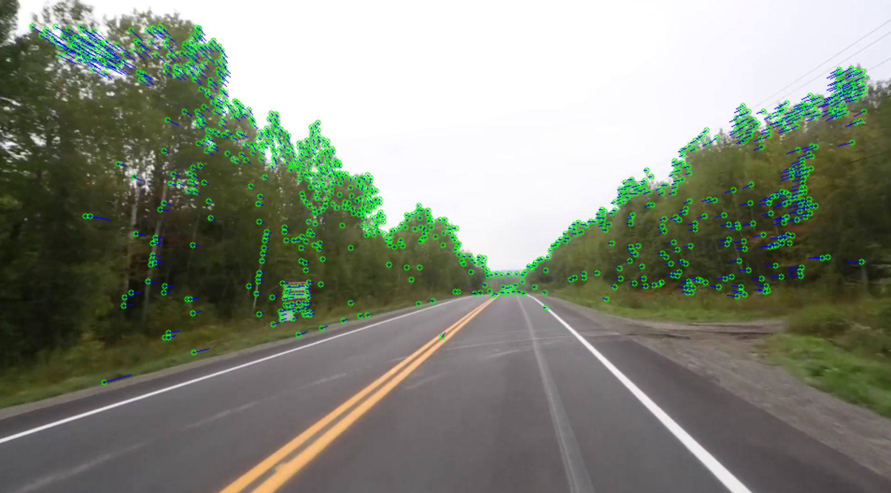

# SLAM

What is SLAM?

It is Simultaneous localization and mapping, a method used to help robots map areas and find their way

## Requirements
`opencv-python`

`numpy`

`PySDL2`

`scikit-image`

## ToDo

- [ ] Let user upload video using GUI
- [ ] Improve the SLAM program
- [ ] Reduce the python code
- [x] Save data in `Data` folder
- [x] Update & Append data in `Data` folder

